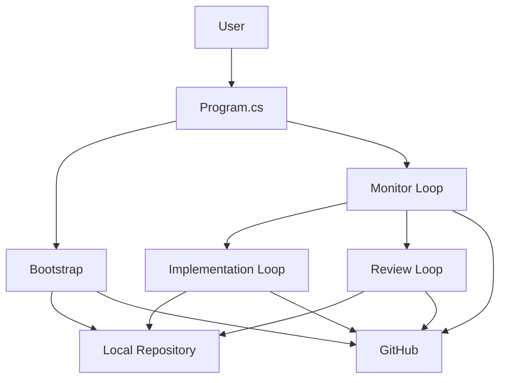

# Architecture

This project is a demo of a small agentic delivery loop, not a production orchestration platform. The design goal is to make the moving parts easy to explain while still using real GitHub state and real repository mutations.

## System View



## Main Components

### `Program.cs`

`Program.cs` is the visible orchestrator. It keeps the demo honest by showing the entire outer loop in one place:

- parse the GitHub URL and choose the working folder
- execute the bootstrap feature
- create the monitor, implementer, and reviewer sessions
- keep polling the monitor and start worker loops only when needed
- stop cleanly on cancellation

### Bootstrap Feature

`BootstrapFeature` owns the one-time startup plumbing that should happen before the outer loop begins:

- locate the orchestrator's `.github` folder
- create the bootstrap client rooted in the working folder
- clone or refresh the target repository and ensure labels exist
- create the working client rooted in the target repository

This keeps `Program.cs` focused on the long-running orchestration loop.

### Bootstrap Session

The bootstrap session runs on the free model and performs low-value but necessary work:

- clone the repo or pull latest changes
- ensure the status labels exist
- confirm whether open issues already exist

This keeps repository preparation out of the expensive worker sessions.

### Monitor Loop

The monitor loop is the coordinator. It checks GitHub state and reports its decision by calling the `report_monitor_decision` tool with typed parameters:

- `implementersToStart`
- `reviewersToStart`
- `hasAnyWork`
- `reason`

Because the decision is a tool call with validated parameters — not free-text or JSON — the host always receives a structured, machine-readable result regardless of model behaviour. The monitor also calls `get_worker_loop_state` to learn how many workers are already running before deciding how many to start.

It does not implement or review anything. Its job is only to decide whether the more expensive sessions should run.

### Implementation Loop

The implementer loop performs one work iteration at a time using the `implementer` agent. Its priority order is deliberate:

1. Merge PRs that are already approved.
2. Fix PRs that received review feedback.
3. Pick up a new open issue only when no higher-priority PR work exists.

That priority keeps the system from creating new work while older work is stuck waiting.

When no implementation work remains, the agent calls the `signal_no_more_implementation_work` tool. The host detects that tool call to know the loop should go idle — it never has to guess from free text.

### Review Loop

The review loop performs one review iteration at a time using the `reviewer` agent. It looks for PRs marked `status:ready-for-review`, reviews them, and moves them to one of two next states:

- `status:approved`
- `status:needs-work`

When no review work remains, the agent calls the `signal_no_more_review_work` tool to signal the host.

### SDK Sessions

Each component talks directly to `CopilotSession` using the SDK's built-in `SendAndWaitAsync(...)` API. The runtime stays non-interactive by not enabling `OnUserInputRequest` in the session config.

## Design Choices That Matter

### GitHub Is the State Store

The application does not keep a local tracker for issues or PRs. Open issues, PR labels, and review decisions are the state model. That keeps the demo inspectable and removes a whole class of synchronization problems.

### Agents and Skills Stay Outside the Target Repo

The runtime loads agents from the orchestrator's `.github/agents` folder through `ConfigDir`, and shared skills from `.github/skills` through `SkillDirectories`. The target repository is cloned for work, but it does not need to own the orchestration configuration.

### The Cost Boundary Is a Session Boundary

Model selection happens per session, not per prompt. That is why bootstrap and monitoring are separate sessions from implementation and review.

### Tools Are the Structured Interface

Every loop communicates its result through typed tool calls, not free-text or JSON in the response body. The monitor calls `report_monitor_decision`, the workers call their respective stop tools, and all loops call `report_key_event` for console logging.

This matters because tool calls have validated parameters: the host receives structured data it can act on without parsing. It removes an entire category of reliability problems around output format compliance.

### The Worker Loops Are Disposable

The implementer and reviewer loops are expected to stop when the agent determines that no more work of that type is currently available and signals that state explicitly. They are restarted by the monitor loop later if new work shows up. This keeps the long-running part of the system cheap.

The reusable worker mechanics live in a shared `WorkerLoop`, while `ImplementationLoop` and `ReviewLoop` stay as thin role definitions that make it obvious how to add another agent type later.

## Runtime File Map

```text
src/AgenticCodingLoop/
  Program.cs
  Features/
    Bootstrap/
      BootstrapFeature.cs
      RepositorySetup.cs
      repository-setup.prompt.md
    Monitor/
      MonitorFeature.cs
      monitor-loop.prompt.md
      Tools/
        MonitorDecisionTool.cs
        MonitorEventTool.cs
        MonitorWorkerStateTool.cs
    Implementer/
      ImplementerFeature.cs
      implementation-loop.prompt.md
      Tools/
        ImplementerEventTool.cs
        ImplementationStopTool.cs
    Reviewer/
      ReviewerFeature.cs
      review-loop.prompt.md
      Tools/
        ReviewerEventTool.cs
        ReviewStopTool.cs
  Shared/
    HostEnvironment/
      CopilotCliLocator.cs
      NonInteractiveCliEnvironment.cs
      SourceGitHubLocator.cs
    Prompts/
      PromptLoader.cs
    Runtime/
      CopilotModels.cs
      SessionDebugConsole.cs
      WorkerLoop.cs
      IWorkerFeature.cs
      WorkerSessionConfigFactory.cs
      WorkerRoleDescriptor.cs
      WorktreeManager.cs
  Host/
    WorkspaceConfig.cs
```

The repo now keeps feature-specific behavior under `Features`, while shared runtime, host-environment, and prompt-loading concerns live under `Shared`.

Supporting bootstrap helpers such as the local CLI environment and `.github` locator live under `Shared/HostEnvironment`, but they are intentionally omitted from the flowchart because they are implementation details rather than runtime roles.

## What This Architecture Optimizes For

- demo clarity over framework depth
- inspectable behavior over hidden automation
- real GitHub workflows over custom state management
- low idle cost through cheap monitoring
- simple extension points for future experiments